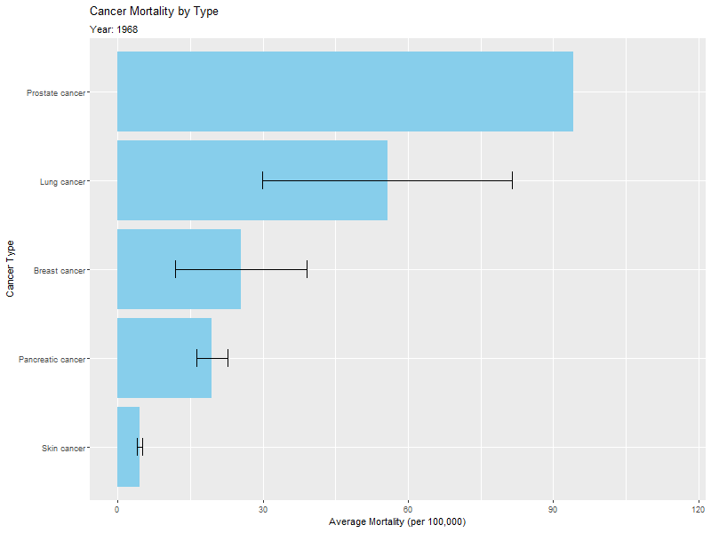

```{r setup, include=FALSE}
knitr::opts_chunk$set(echo = TRUE)
```

# Setup

```{r init}
# setwd("~/Desktop/University/AMED3002/") # Set the working directory to wherever you data is
setwd(file.path("C:", "Users", "elwoo", "Desktop", "University", "AMED3002"))
multideath <- read.csv("multideath.csv", fileEncoding = "Windows-1252")
cancer_rates <- read.csv("cancerrates.csv")
```

# Data Filter

```{r cancer_rates}
library(dplyr)
cancer_subset <- cancer_rates %>%
  filter(
    Cancer_Type %in% c("Breast cancer", "Lung cancer", "Pancreatic cancer", "Prostate cancer", "Non-melanoma skin cancer, all types", "Melanoma of the skin", "Non-melanoma skin cancer, rare types")
  )

cancer_subset <- cancer_subset %>%
  mutate(Cancer_Type = case_when(
    Cancer_Type %in% c("Melanoma of the skin", 
                       "Non-melanoma skin cancer, all types", 
                       "Non-melanoma skin cancer, rare types") ~ "Skin cancer",
    TRUE ~ Cancer_Type
  ))
unique(cancer_subset$Cancer_Type)
```

```{r multi_death}
library(dplyr)
multi_subset <- multideath %>%
  filter(
    cause_of_death %in% c("Breast cancer (ICD-10 C50)", "Lung cancer (ICD-10 C33, C34)", "Pancreatic cancer (ICD-10 C25)", "Prostate cancer (ICD-10 C61)", "Skin cancer (ICD-10 C43, C44)")
  )

multi_subset$cause_of_death <- sapply(multi_subset$cause_of_death, 
                                       function(x) switch(as.character(x),
                                                          "Breast cancer (ICD-10 C50)" = "Breast cancer",
                                                          "Lung cancer (ICD-10 C33, C34)" = "Lung cancer",
                                                          "Pancreatic cancer (ICD-10 C25)" = "Pancreatic cancer",
                                                          "Prostate cancer (ICD-10 C61)" = "Prostate cancer",
                                                          "Skin cancer (ICD-10 C43, C44)" = "Skin cancer")
                                      )
unique(multi_subset$cause_of_death)
```

# Cancer_Rates: Time vs Mortality - How many people die over the years for LUNG CANCER

```{r cancer_rates_time_vs_mortality_preprocessing}
library(tidyr)
library(dplyr)
cancer_rates_lung <- cancer_subset %>%
  filter(Cancer_Type == "Lung cancer", Type == "Mortality") %>%
  drop_na()

age_cols <- grep("^Age_\\d|^Age_85\\+|^Age_Unknown", names(cancer_rates_lung), value = TRUE)

cancer_rates_lung_summary <- cancer_rates_lung %>%
  rowwise() %>%
  mutate(cancer_rates_lung_avg_mortality = mean(c_across(all_of(age_cols)), na.rm = TRUE)) %>%
  ungroup() %>%
  group_by(Year) %>%
  summarise(
    standard_error = sd(cancer_rates_lung_avg_mortality, na.rm = TRUE) / sqrt(n()),
    cancer_rates_lung_avg_mortality = mean(cancer_rates_lung_avg_mortality, na.rm = TRUE)
  )
```

```{r cancer_rates_time_vs_mortality_plot}
library(ggplot2)
ggplot(cancer_rates_lung_summary, aes(x = Year, y = cancer_rates_lung_avg_mortality)) +
  geom_point(color = "blue", size = 2) +
  geom_errorbar(
    aes(
      ymin = cancer_rates_lung_avg_mortality - standard_error,
      ymax = cancer_rates_lung_avg_mortality + standard_error
    ),
    width = 0.2,  # controls the width of the error bars
    color = "black"
  ) +
  scale_x_continuous(limits = c(1945, 2020), breaks = seq(1950, 2020, by = 10)) +
  labs(
    title = "Average Lung Cancer Mortality Over Time",
    x = "Year",
    y = "Average Mortality (across age groups)"
  )
```

# Multi_Death: Time vs Mortality - How many people die over the years for LUNG CANCER

```{r}
library(tidyr)
library(dplyr)
multi_death_lung <- multi_subset %>%
  filter(cause_of_death == "Lung cancer") %>%
  drop_na()

multi_death_lung_summary <- multi_death_lung %>%
  group_by(year) %>%
  summarise(
    standard_error = sd(age_standardised_rate_per_100000, na.rm = TRUE) / sqrt(n()),
    avg_mortality = mean(age_standardised_rate_per_100000, na.rm = TRUE)
    )

library(ggplot2)
ggplot(multi_death_lung_summary, aes(x = year, y = avg_mortality)) +
  geom_point(color = "blue", size = 2) +  
  geom_errorbar(
    aes(
      ymin = avg_mortality - standard_error,
      ymax = avg_mortality + standard_error
    ),
    width = 0.2,  # controls the width of the error bars
    color = "black"
  ) +
  labs(
    title = "Average Lung Cancer Mortality Over Time",
    x = "Year",
    y = "age_standardised_rate_per_100000"
  )
```

# Cancer_Rate: Cancer Type vs Overall Mortality - How many people die over the years for EACH CANCER

```{r}
library(tidyr)
library(dplyr)
cancer_rates_mortality <- cancer_subset %>%
  filter(Type == "Mortality")

age_cols <- grep("^Age_\\d|^Age_85\\+|^Age_Unknown", names(cancer_rates_mortality), value = TRUE)

cancer_rates_mortality <- cancer_rates_mortality %>%
  rowwise() %>%
  mutate(overall_mortality = mean(c_across(all_of(age_cols)), na.rm = TRUE)) %>%
  ungroup()

cancer_rates_mortality <- cancer_rates_mortality %>%
  group_by(Cancer_Type) %>%
  summarise(
    standard_error = sd(overall_mortality, na.rm = TRUE) / sqrt(n()),
    avg_mortality = mean(overall_mortality, na.rm = TRUE)
    ) %>%
  arrange(desc(avg_mortality))

library(ggplot2)
ggplot(cancer_rates_mortality, aes(x = reorder(Cancer_Type, avg_mortality), y = avg_mortality)) +
  geom_col(fill = "skyblue") +
  coord_flip() +  
  geom_errorbar(
    aes(
      ymin = avg_mortality - standard_error,
      ymax = avg_mortality + standard_error
    ),
    width = 0.2,  # controls the width of the error bars
    color = "black"
  ) +
  labs(
    title = "Overall Mortality by Cancer Type",
    x = "Cancer Type",
    y = "Average Mortality (per 100,000 across age groups)"
  )
```

# ANIMATION: Cancer_Rate | Cancer Type vs Overall Mortality - How many people die over the years for EACH CANCER

```{r}
library(tidyr)
library(dplyr)
cancer_rates_mortality <- cancer_subset %>%
  filter(Type == "Mortality") %>%
  drop_na()

age_cols <- grep("^Age_\\d|^Age_85\\+|^Age_Unknown", names(cancer_rates_mortality), value = TRUE)

cancer_rates_mortality <- cancer_rates_mortality %>%
  rowwise() %>%
  mutate(overall_mortality = mean(c_across(all_of(age_cols)), na.rm = TRUE)) %>%
  ungroup()

cancer_rates_mortality_yearly <- cancer_rates_mortality %>%
  group_by(Year, Cancer_Type) %>%
  summarise(
    avg_mortality = mean(overall_mortality, na.rm = TRUE),
    standard_error = if(n() > 1) sd(overall_mortality, na.rm = TRUE) / sqrt(n()) else NA_real_,
    .groups = "drop"
  )

library(ggplot2)
library(gganimate)

p <- ggplot(cancer_rates_mortality_yearly, aes(x = reorder(Cancer_Type, avg_mortality), y = avg_mortality)) +
  geom_col(fill = "skyblue") +
  geom_errorbar(
    aes(
      ymin = avg_mortality - standard_error,
      ymax = avg_mortality + standard_error
    ),
    width = 0.2,
    color = "black"
  ) +
  coord_flip() +
  labs(
    title = "Cancer Mortality by Type",
    subtitle = "Year: {closest_state}",
    x = "Cancer Type",
    y = "Average Mortality (per 100,000)"
  ) +
  transition_states(Year, transition_length = 2, state_length = 1) +
  ease_aes("cubic-in-out")
```

```{r}
animate(p, nframes = 500, fps = 25, width = 800, height = 600)

anim_save("cancer_mortality_by_year.gif", animation = last_animation())
```



# Multi_Death: Cancer Type vs Overall Mortality - How many people die over the years for EACH CANCER

```{r}
library(tidyr)
library(dplyr)
multi_death_mortality <- multi_subset %>%
  filter(!is.na(age_standardised_rate_per_100000))

multi_death_mortality <- multi_death_mortality %>%
  group_by(cause_of_death) %>%
  summarise(
    standard_error = sd(age_standardised_rate_per_100000, na.rm = TRUE) / sqrt(n()),
    avg_mortality = mean(age_standardised_rate_per_100000, na.rm = TRUE)
    ) %>%
  arrange(desc(avg_mortality))

library(ggplot2)
ggplot(multi_death_mortality, aes(x = reorder(cause_of_death, avg_mortality), y = avg_mortality)) +
  geom_col(fill = "skyblue") +
  coord_flip() +
  geom_errorbar(
    aes(
      ymin = avg_mortality - standard_error,
      ymax = avg_mortality + standard_error
    ),
    width = 0.2,  # controls the width of the error bars
    color = "black"
  ) +
  labs(
    title = "Average Mortality by Cause of Death",
    x = "Cause of Death",
    y = "Average Mortality Rate (per 100,000)"
  )
```

# Cancer_Rate: Cancer Type vs Overall Mortality - How many people die over the years for EACH CANCER group by sex

```{r}
library(tidyr)
library(dplyr)
cancer_rates_mortality <- cancer_subset %>%
  filter(Type == "Mortality") %>%
  drop_na()

age_cols <- grep("^Age_\\d|^Age_85\\+|^Age_Unknown", names(cancer_rates_mortality), value = TRUE)

cancer_rates_mortality <- cancer_rates_mortality %>%
  rowwise() %>%
  mutate(overall_mortality = mean(c_across(all_of(age_cols)), na.rm = TRUE)) %>%
  ungroup()

cancer_rates_mortality_summary <- cancer_rates_mortality %>%
  group_by(Cancer_Type, Sex) %>%
  summarise(
    standard_error = if (n() > 1) sd(overall_mortality, na.rm = TRUE) / sqrt(n()) else NA_real_,
    avg_mortality = mean(overall_mortality, na.rm = TRUE),
    .groups = "drop"
  ) %>%
  arrange(desc(avg_mortality))

library(ggplot2)
ggplot(cancer_rates_mortality_summary, aes(x = reorder(Cancer_Type, avg_mortality), y = avg_mortality, fill = Sex)) +
  geom_col(position = position_dodge()) +
  geom_errorbar(
    aes(
      ymin = avg_mortality - standard_error,
      ymax = avg_mortality + standard_error
    ),
    position = position_dodge(width = 0.9),
    width = 0.2,
    color = "black"
  ) +
  coord_flip() +
  labs(
    title = "Overall Mortality by Cancer Type and Gender",
    x = "Cancer Type",
    y = "Average Mortality (per 100,000 across age groups)"
  )
```

# Multi_Death: Cancer Type vs Overall Mortality - How many people die over the years for EACH CANCER group by sex

```{r}
library(tidyr)
library(dplyr)
multi_death_mortality <- multi_subset %>%
  filter(!is.na(age_standardised_rate_per_100000))

multi_death_mortality_summary <- multi_death_mortality %>%
  group_by(cause_of_death, sex) %>%
  summarise(
    avg_mortality = mean(age_standardised_rate_per_100000, na.rm = TRUE),
    standard_error = if(n() > 1) sd(age_standardised_rate_per_100000, na.rm = TRUE) / sqrt(n()) else NA_real_,
    .groups = "drop"
  ) %>%
  arrange(desc(avg_mortality))

library(ggplot2)
ggplot(multi_death_mortality_summary, aes(x = reorder(cause_of_death, avg_mortality), y = avg_mortality, fill = sex)) +
  geom_col(position = position_dodge()) +
  geom_errorbar(
    aes(
      ymin = avg_mortality - standard_error,
      ymax = avg_mortality + standard_error
    ),
    position = position_dodge(width = 0.9),
    width = 0.2,
    color = "black"
  ) +
  coord_flip() +
  labs(
    title = "Average Mortality by Cause of Death and Sex",
    x = "Cause of Death",
    y = "Average Mortality Rate (per 100,000)"
  )
```

# Cancer_Rates: Mortality vs Time - Who dies more, males or females? over time

```{r}
library(tidyr)
library(dplyr)
cancer_rates_mortality <- cancer_subset %>%
  filter(Type == "Mortality")

age_cols <- grep("^Age_\\d|^Age_85\\+|^Age_Unknown", names(cancer_rates_mortality), value = TRUE)

cancer_rates_mortality <- cancer_rates_mortality %>%
  rowwise() %>%
  mutate(overall_mortality = mean(c_across(all_of(age_cols)), na.rm = TRUE)) %>%
  ungroup()

cancer_rates_sex_mortality <- cancer_rates_mortality %>%
  group_by(Year, Sex) %>%
  summarise(avg_mortality = mean(overall_mortality, na.rm = TRUE), .groups = "drop")

library(ggplot2)
ggplot(cancer_rates_sex_mortality, aes(x = Year, y = avg_mortality, color = Sex)) +
  geom_line(size = 1.2) +
  scale_x_continuous(limits = c(1945, 2020), breaks = seq(1950, 2020, by = 10)) +
  labs(
    title = "Average Mortality Over Time by Sex",
    x = "Year",
    y = "Average Mortality (across age groups)"
  )
```

# Multi_Death: Mortality vs Time - Who dies more, males or females? over time

```{r}
library(tidyr)
library(dplyr)
multi_death_mortality <- multi_subset %>%
  filter(!is.na(age_standardised_rate_per_100000))

multi_death_sex_mortality <- multi_death_mortality %>%
  group_by(year, sex) %>%
  summarise(avg_mortality = mean(age_standardised_rate_per_100000, na.rm = TRUE), .groups = "drop")

library(ggplot2)
ggplot(multi_death_sex_mortality, aes(x = year, y = avg_mortality, color = sex)) +
  geom_line(size = 1.2) +
  labs(
    title = "Average Mortality Over Time by Sex",
    x = "Year",
    y = "Average Crude Mortality Rate (per 100,000)"
  )
```

# Combined Setup

```{r}
multi_subset_preprocess <- multi_subset %>%
  rename(Gender = sex)
multi_subset_preprocess <- multi_subset_preprocess %>%
  rename(Cancer_Type = cause_of_death)
multi_subset_preprocess <- multi_subset_preprocess %>%
  rename(Year = year)

cancer_subset_preprocess <- cancer_subset %>%
  rename(Gender = Sex)

combined_cancer_data <- bind_rows(cancer_subset_preprocess, multi_subset_preprocess)
```


